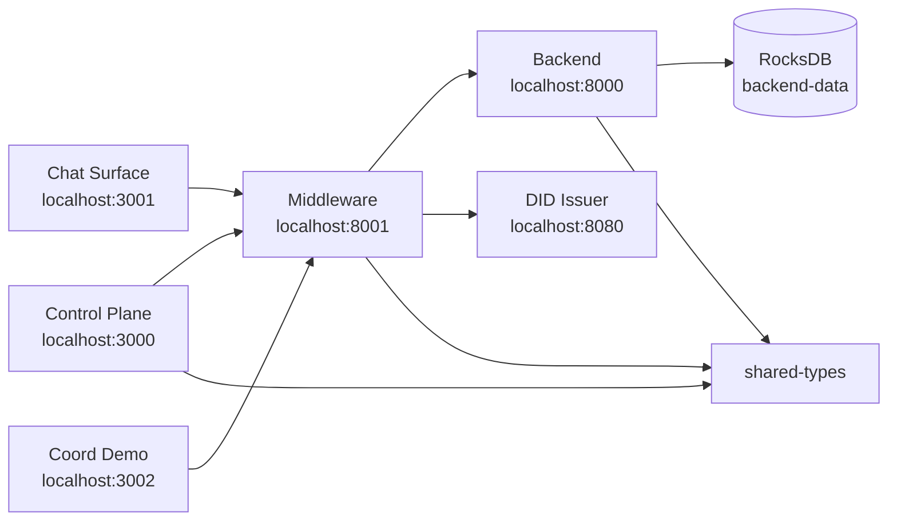

# Dual-Substrate System (DSS)

[](https://github.com/berigny/dss-system)
[](LICENSE)
[]()
[](https://github.com/berigny/dss-system/actions)
[]()
[]()

DSS is a ledger-oriented architecture for memory-stable, audit-ready AI agents.

Most Large Language Model (LLM) applications rely on transient context windows, easily-confused semantic vector RAG, and mutable databases. DSS replaces these opaque, fragile systems with a deterministic, mathematically motivated coordinate engine (inspired by p-adic numbers and the R x Q_p dual substrate) and an immutable cryptographic ledger.

This is the official monorepo for the DSS control plane, middleware, chat surface, coordinate demo, DID issuer, and shared packages.

---

## Applications in this Monorepo

This repository is managed as a monorepo. The core components live under `apps/`.

### 1. Chat Surface


A lightweight, threadless conversational front-end. Users converse in a single continuous interface, trusting the underlying DSS coordinate engine to bridge current context with past memories regardless of when they occurred.

### 2. Orchestrator Middleware


The brain of the Dual-Substrate routing system. Handles Qp-pure coordinate resolution and structural coherence validation before any data reaches the LLM. It also acts as a multi-model adapter, allowing users to switch AI providers without breaking session context.

### 3. Governance Control Plane


Cryptographic identity and memory auditing. Manages Principal Registries, W3C Decentralized Identifiers (DIDs), and the hash-chain memory ledger. Users control exactly what data is shared and inspect the lineage of how the AI formed its memories.

### 4. Coordinate Sandbox (Coord-Demo)


A developer sandbox and demonstration environment for testing, visualising, and pushing the limits of the prime-lattice coordinate routing math that powers DSS coherence.

---

## Architecture



- **control-plane** — trust-anchor, identity, governance, benchmark, and surface management dashboard.
- **chat-surface** — end-user chat UI.
- **coord-demo** — minimal COORD resolver demo and coordinate sandbox.
- **middleware** — auth, proxy, orchestration, and OpenRouter model library gateway.
- **backend** — ledger storage, coordinate resolution, retrieval, ingestion, governance, and admin APIs.
- **did-issuer** — walt.id-based `DssIdentity` credential issuance.
- **shared-types** — reusable Pydantic models and clients imported by the Python apps.

---

## Current Capabilities and Maturity

DSS is an evolving framework. This is a transparent look at what is currently stable and where we are heading.

| Feature | Maturity | Description |
| --- | --- | --- |
| Multi-model, provider-agnostic routing | High (stable) | Switch between AI models on the fly. An adapter pattern normalises payloads across providers, separating model-specific execution from session state. |
| Threadless, coordinate-based coherence | Moderate (prototype) | Uses prime-lattice coordinate routing to maintain context without relying on a sidebar of past threads. Long-horizon recall on noisy, non-synthetic dialogue is still being benchmarked. |
| Cryptographic data freedom and sharing | High (strong foundation) | Users hold the keys to their data. DSS leverages Decentralized Identifiers (DIDs) and authorisation wrappers so specific memories can be shared securely. |
| Deep memory lineage | High (traceability exists) | Trace the exact context the model used to form an answer. The orchestrator logs how context was scored, selected, and linked back to recursive prime coordinates. |

---

## Quick Start (Development)

1. Clone the repository:

   ```bash
   git clone https://github.com/berigny/dss-system.git
   cd dss-system
   ```

2. Copy and edit the environment file:

   ```bash
   cp .env.example .env
   # Fill in all secrets and adjust public URLs for your deployment.
   ```

3. Start the stack:

   ```bash
   make dev
   ```

4. Wait for all services to become healthy:

   ```bash
   docker compose ps
   ```

5. Open the local services:

   - Control Plane: http://localhost:3000
   - Chat Surface: http://localhost:3001
   - Coord Demo: http://localhost:3002
   - Middleware: http://localhost:8001
   - Backend: http://localhost:8000
   - DID Issuer: http://localhost:8080

### First-time onboarding

The first wallet-verified signup is auto-approved so a new user can complete `register -> setup -> Control Plane auth` without waiting for a human operator. Set `AUTO_APPROVE_FIRST_SIGNUP=false` to disable this behaviour.

---

## Make Targets

- `make dev` — build and start all services in Docker Compose
- `make down` — stop all services
- `make logs` — follow Docker Compose logs
- `make test` — run test suites inside containers
- `make lint` — placeholder for linting (TBD)

---

## Environment Variables

All environment variables are documented in [`.env.example`](.env.example). At a minimum you must set:

- `PUBLIC_BASE_URL`, `DEFAULT_DID_HOST`
- `FASTHTML_SECRET_KEY`
- `AUTH_SESSION_TOKEN_SECRET`
- `OPENROUTER_API_KEY` (if using online models)
- `ADMIN_TOKEN` / `TRUST_ANCHOR_ADMIN_TOKEN` / `BACKEND_ADMIN_TOKEN` / `MIDDLEWARE_ADMIN_TOKEN`
- `CHAT_BASE_URL`, `COORD_DEMO_BASE_URL`

See `.env.example` for the full list and descriptions.

---

## Deployment Branch Strategy

| Branch | Environment | Trigger |
|--------|-------------|---------|
| `main` | production | merges to `main` deploy prod apps via GitHub Actions |
| `develop` | staging / preview | merges to `develop` deploy staging Fly apps and Vercel preview deployments |
| `feature/*` | none | open a pull request; only affected apps are tested by `ci.yml` |

---

## CI / CD

GitHub Actions workflows live in `.github/workflows/`:

- `ci.yml` — path-filtered tests and lint on PRs and pushes to `main`/`develop`.
- `deploy-control-plane.yml`, `deploy-chat-surface.yml`, `deploy-coord-demo.yml` — deploy FastHTML apps to Vercel.
- `deploy-backend.yml`, `deploy-middleware.yml`, `deploy-did-issuer.yml` — deploy containerised apps to Fly.io.

### Required Repository Secrets

| Secret | Used by |
|--------|---------|
| `FLY_API_TOKEN` | Fly.io deploy workflows |
| `VERCEL_TOKEN` | Vercel deploy workflows |
| `VERCEL_ORG_ID` | Vercel deploy workflows |
| `VERCEL_PROJECT_ID_CONTROL_PLANE` | `deploy-control-plane.yml` |
| `VERCEL_PROJECT_ID_CHAT_SURFACE` | `deploy-chat-surface.yml` |
| `VERCEL_PROJECT_ID_COORD_DEMO` | `deploy-coord-demo.yml` |

See [`docs/staging.md`](docs/staging.md) and [`docs/production.md`](docs/production.md) for detailed runbooks.

---

## Structure

```
.
├── apps/              # One directory per service
├── packages/          # Shared packages (shared-types)
├── infra/             # Terraform / Pulumi / Fly / Vercel configs (placeholder)
├── docs/              # Architecture and runbook docs
├── docker-compose.yml
├── Makefile
└── .env.example
```

---

## License

Apache 2.0 — see [LICENSE](LICENSE).
