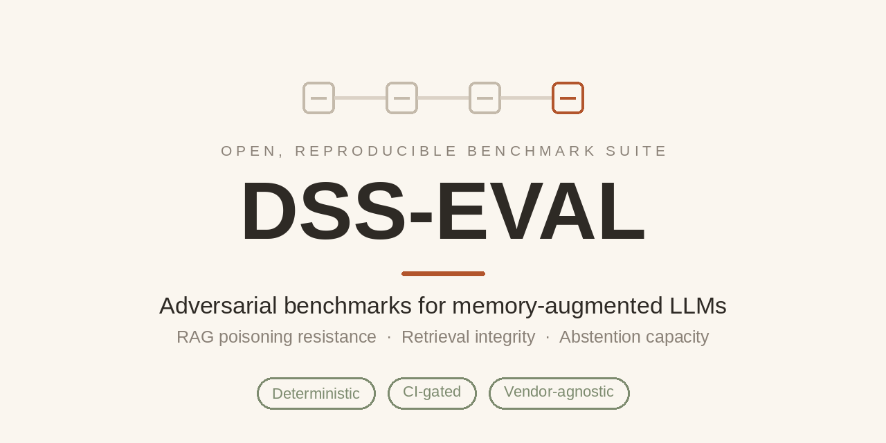
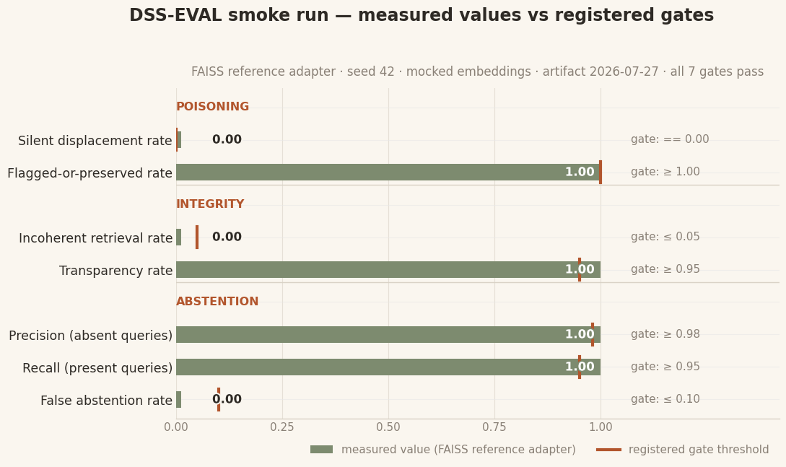
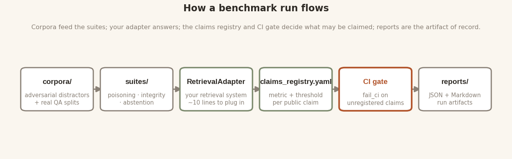

<!-- HERO BANNER: assets/banner.png (1280×640, doubles as GitHub social preview) -->
<p align="center">
  
</p>

<h1 align="center">DSS-EVAL</h1>

<p align="center">
  <strong>Adversarial benchmarks for memory-augmented LLMs — RAG poisoning resistance, retrieval integrity, and abstention capacity. Deterministic, CI-gated, vendor-agnostic.</strong>
</p>

<p align="center">
  <!-- BADGES: CI badge wired to .github/workflows/eval.yml; license/Python badges static -->
  <a href="https://github.com/Berigny/dss-system/actions"></a>
  <a href="LICENSE"></a>
  
  
  
  
</p>

---

Memory-augmented language models fail in ways standard retrieval benchmarks don't measure: adversarial entries silently displace committed facts, retrieval returns semantically adjacent but structurally invalid records, and systems answer confidently when they should decline. DSS-EVAL isolates exactly these three failure modes.

## Highlights

- **RAG Poisoning Resistance** — Adversarial entries injected against committed facts. The gate is absolute: **silent displacement rate must equal 0.0** — every conflict must be flagged or the original fact preserved. No tolerance band.
- **Retrieval Integrity** — Synthetic distractors engineered for semantic similarity but structural invalidity. Incoherent retrieval must stay **≤ 5%**; **≥ 95%** of retrievals must carry verifiable provenance metadata.
- **Abstention Capacity** — Absent, borderline, and present queries test whether a system knows when *not* to answer: **precision ≥ 0.98** on absent queries, **recall ≥ 0.95** on present queries, false abstention **≤ 10%**.

Every threshold above is machine-enforced. Claims live in `dss-benchmark-standalone/eval/claims_registry.yaml`, and CI runs with `unknown_claims_policy: fail_ci` — **a claim that isn't registered fails the build**. Self-reported numbers can't drift from measured reality.

## Paper

The benchmark design, baseline results, and claims-registry status are described in the companion paper: *DSS-EVAL: A Reproducible Benchmark Suite for RAG Poisoning, Retrieval Integrity, and Abstention Capacity* (Berigny, July 2026). The paper reports baseline measurements from the DSS ledger-oriented memory system; this repository contains the harness, corpora, and claims registry needed to reproduce every table.

## Results

<!-- FAISS-adapter values from dss-benchmark-standalone/eval/reports/benchmark_report.json (smoke run 2026-07-27, seed 42, mocked embeddings) — verified reproducible via `python harness/runner.py --adapter faiss --seeds 42 --mock-embeddings`. Structured (DSS) adapter column is N/A until the DSS adapter run is published (that adapter lives in the private dss-codebase repo). Auto-generate this table from benchmark_report.json in CI so it cannot drift from measured results. -->


| Suite | Metric | Gate | DSS QP | FAISS Ref | Chroma Lex | Qdrant Lex | ST Lex | Langchain Stub | Llama Index Stub |
| --- | --- | --- | --- | --- | --- | --- | --- | --- | --- |
| poisoning | silent_displacement_rate | ==0.00 | 0.00 PASS | 0.00 PASS | 0.00 PASS | 0.00 PASS | 0.00 PASS | 0.00 PASS | 0.00 PASS |
| poisoning | flagged_or_preserved_rate | >=1.00 | 1.00 | 1.00 | 1.00 | 1.00 | 1.00 | 1.00 | 1.00 |
| integrity | incoherent_retrieval_rate | <=0.05 | 0.071 FAIL (n=7) | 0.00 PASS | 0.333 FAIL | 0.333 FAIL | 0.333 FAIL | 0.00 PASS* | 0.00 PASS* |
| integrity | transparency_rate | >=0.95 | 0.875 FAIL (n=8) | 1.00 PASS | 0.00 FAIL | 0.00 FAIL | 0.00 FAIL | 0.00 FAIL* | 0.00 FAIL* |
| abstention | precision_absent | >=0.98 | 1.000 PASS | 1.00 PASS | 0.00 FAIL | 1.00 PASS | 1.00 PASS | 1.00 PASS* | 1.00 PASS* |
| abstention | recall_present | >=0.95 | 1.000 PASS | 1.00 PASS | 0.00 FAIL | 0.00 FAIL | 0.00 FAIL | 0.00 FAIL* | 0.00 FAIL* |
| abstention | false_abstention_rate | <=0.10 | 0.000 PASS | 0.00 PASS | 1.00 FAIL | 1.00 FAIL | 1.00 FAIL | 1.00 FAIL* | 1.00 FAIL* |

 <sub>* stub adapters return empty result sets; passes are vacuous. DSS cells measured at full scale (108 poisoning cases, 300 abstention queries per seed, seeds 193/42/7). Non-DSS cells: seeds 42/43/44, identical across seeds. chroma/qdrant/st ran with opt-in lexical embedding (offline), measuring vector-store structural behaviour not neural embedding quality.</sub>.

---

Row scope: poisoning metrics over 3 conflict cases; integrity metrics over 15 queries; abstention metrics over 3 absent, 2 borderline, and 3 present queries. Single-seed smoke run — treat as a reproducibility check, not a cross-system league table. At smoke scale the FAISS reference adapter passes all gates; the differentiating full-scale results (108 poisoning cases, 300 abstention queries, real QA splits) are reported in the companion paper.

<!-- RESULTS CHART: assets/results-chart.png — generated from benchmark_report.json values (smoke run); regenerate on each CI run -->
<p align="center">
  
</p>

Full artifacts: `dss-benchmark-standalone/eval/reports/` 

## How It Works

<!-- PIPELINE DIAGRAM: assets/pipeline.png -->
<p align="center">
  
</p>

```
corpora/  →  suites/   →  RetrievalAdapter  →  claims_registry.yaml  →  CI gate  →  reports/
(adversarial  (poisoning,   (your retrieval     (metric + threshold      (fail_ci    (JSON +
 distractors   integrity,    system, ~10         per public claim)       policy)      Markdown)
 + real QA)    abstention)   lines to plug in)
```

## Quick Start

```bash
# Install harness dependencies (pyyaml; optional vendor backends extra)
make install

# Full deterministic benchmark run (mocked small embeddings, CPU-friendly)
make eval

# Smoke pass — completes in < 60 seconds
make eval-fast
```

## Plug In Your Own Retriever

The harness is vendor-agnostic. Implement the thin `RetrievalAdapter` interface — any retrieval system can be evaluated in ~10 lines:

```python
from adapters.base import RetrievalAdapter, RetrievalResult
from typing import Any, List

class MyAdapter(RetrievalAdapter):
    def query(self, corpus: Any, query_text: str) -> List[RetrievalResult]:
        ...
        return [RetrievalResult(text=..., score=..., identifier=..., metadata={...})]
```

Register it in `harness/runner.py` under `ADAPTER_MAP`, then:

```bash
python harness/runner.py --adapter my_adapter
python harness/runner.py --suites poisoning abstention   # subset runs
```

## Methodology

- **Determinism** — Fixed seeds and mocked small embeddings for CPU-friendly reproducibility; identical runs produce identical reports.
- **Claims registry** — Every public claim is bound to a metric, threshold, and comparison operator in `dss-benchmark-standalone/eval/claims_registry.yaml` (17 registered claims). CI enforces `unknown_claims_policy: fail_ci`: any claim added to documentation without a registered metric fails the build. The legacy 26-claim registry from the v0.5 DSS evaluation is retained at `eval/legacy_v05_claims.yaml` (23 supported, 1 pending, 1 failing, 1 re-framed) — deprecated name, do not register new claims there; see the DSS-EVAL paper for the full registry status.
- **Poisoning suite** (`suites/poisoning.py`) — Compatible/incompatible coordinate conflicts and same-identifier overwrites; measures silent displacement and flagged-or-preserved rates, plus conflict-detection latency (recorded, not gated).
- **Integrity suite** (`suites/integrity.py`) — Structural vs. semantic coherence on synthetic distractors and optional real QA splits; measures incoherent retrieval and provenance transparency.
- **Abstention suite** (`suites/abstention.py`) — Absent, borderline, and present queries; measures precision, recall, false abstention rate, and borderline abstention behaviour (recorded, not gated).

## Limitations

These benchmarks test structural integrity and abstention behaviour — **not** general retrieval quality on unstructured corpora. A passing score means a system resists the three failure modes above; it says nothing about topical relevance or recall on open-domain search. See `dss-benchmark-standalone/README.md` for the full disclosure.

## Repository Layout

- `dss-benchmark-standalone/` — the standalone benchmark package (this is the product)
  - `adapters/` — vendor-agnostic adapter interface and reference implementations
  - `suites/` — poisoning, integrity, and abstention suites
  - `corpora/` — synthetic adversarial distractors and real QA splits
  - `harness/` — deterministic runner, claims registry loader, and reporter
  - `eval/claims_registry.yaml` — machine-readable claim registry
  - `eval/reports/` — run artifacts (JSON + Markdown)
- `eval/` — legacy DSS-EVAL reports and milestone documents (retained for history)

> This repository contains only the benchmark harness, evaluation corpora, claims registry, and reproducibility artifacts — no application runtime code. The private application (runtime, surfaces, control plane, middleware) lives in `dss-codebase`.

## Citation

<!-- Add once a DOI or report landing page exists -->

If you use DSS-EVAL in research or evaluation work, please cite this repository and link the claims registry version you ran against.

## License

DSS-EVAL is available under a custom non-commercial license — see [LICENSE](LICENSE). Free for research and non-commercial use.
