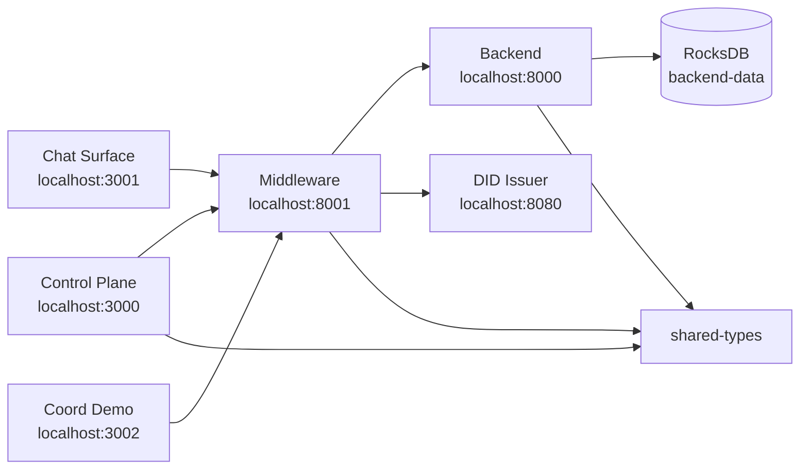

# Dual-Substrate System (DSS)

**Supported By:**

[](https://github.com/berigny/dss-system)
[](LICENSE)
[]()
[](https://github.com/berigny/dss-system/actions)
[]()
[]()
[](https://www.researchgate.net/publication/408995995_Beyond_the_Context_Window_A_Ledger-Oriented_Architecture_for_Provable_AI_Memory_Dual-Substrate_System)


Welcome to the **Dual-Substrate System (DSS)** - an open-source framework built to fix how AI memory feels, functions, and is governed.

Instead of wrestling with context limits, black-box reasoning, and messy chat sidebars, DSS provides a fundamentally different user experience:

* **Threadless Coherence:** Stop hunting through a maze of old chat logs. The system remembers what you said, no matter when or where you said it.
* **Marathon Conversations:** Have ultra-long interactions without the AI getting confused, mixing up details, or experiencing "amnesia" just because you've been chatting for a while.
* **Multi-Model, Seamless Context:** Switch between different AI models on the fly without losing a single beat of your ongoing conversation.
* **Absolute Data Freedom & Secure Sharing:** Keep your conversation history and documents exactly where you want them—locally or in the cloud. You hold the cryptographic keys, meaning you can selectively share a single memory or your entire history with another person or model.
* **Deep Memory Lineage:** Never wonder where the AI got its reasoning. Trace the exact pieces of context the model pulled to form its answer, and look backward to see how those memories were created.

> **Read the Whitepaper:** For a complete deep dive into the mathematics, coordinate geometry, and distributed systems engineering behind DSS, read our open technical disclosure: **[Beyond the Context Window: A Ledger-Oriented Architecture for Provable AI Memory](https://www.researchgate.net/publication/408995995_Beyond_the_Context_Window_A_Ledger-Oriented_Architecture_for_Provable_AI_Memory_Dual-Substrate_System)**.

### How It Works

Most Large Language Model (LLM) applications rely on transient context windows, easily-confused semantic vector RAG, and mutable databases. DSS replaces these opaque, fragile systems with a **deterministic, mathematically motivated coordinate engine** (inspired by $p$-adic numbers and the $\mathbb{R} \times \mathbb{Q}_p$ dual substrate) and an **immutable cryptographic ledger**.

---

## Benchmark Highlights 

### 1. Long-Context Needle Retrieval (517K Tokens)

At massive context scales, standard semantic retrieval fails due to distributional noise. DSS's coordinate-guided retrieval locates exact memories deterministically.

| Mode | Recall@1 | MRR | Avg Latency | Note |
| --- | --- | --- | --- | --- |
| **Semantic Only** | 0.00 | 0.0002 | 722.72 ms | Standard Vector-RAG fails completely. |
| **Coordinate Guided** | **1.00** | **1.0000** | 771.60 ms | Prime-lattice path locates the needle exactly. |
| **Full DSS** | **1.00** | **1.0000** | 916.47 ms | Includes strict AND-gated governance validation overhead. |

### 2. Structural Coherence (Qp vs Vector-RAG)

Vector-RAG often retrieves memories that are *semantically* similar but *structurally* wrong. DSS coordinates reject incoherent records before they reach the model.

| System | Precision@1 | Precision@5 | Incoherent Retrieval Rate |
| --- | --- | --- | --- |
| **Vector-RAG** | 0.71 | 0.51 | **49%** (Nearly half of top-1 results violate a structural invariant). |
| **Qp (DSS)** | **1.00** | **0.93** | **7%** (Highly strict structural compliance). |

---

## Standards & Governance Alignment

DSS is built from the ground up to support modern decentralized identity and auditable AI compliance metrics:

* **W3C Decentralized Identifiers (DIDs)**: Anchors human, model, and device identities natively within the memory ledger.
* **UN Transparency Protocol (UNTP)**: Aligns memory tracking and cryptographic provenance trails with global digital supply chain transparency benchmarks.
* **NIST AI Risk Management Framework**: Provides the systemic audit logs required to mitigate context drift and unverified data mutation.

*Note: The following benchmarks are run on synthetic micro-corpora with deterministic evaluation to isolate architectural mechanics. They represent reproducible engineering checks, not yet generalized claims for noisy open-domain corpora.*

---

## Applications in this Monorepo

This repository is managed as a monorepo. The core components live under `apps/`.

### 1. Chat Surface
A lightweight, threadless conversational front-end. Users converse in a single continuous interface, trusting the underlying DSS coordinate engine to bridge current context with past memories regardless of when they occurred.


### 2. Orchestrator Middleware
The brain of the Dual-Substrate routing system. Handles Qp-pure coordinate resolution and structural coherence validation before any data reaches the LLM. It also acts as a multi-model adapter, allowing users to switch AI providers without breaking session context.


### 3. Governance Control Plane
Cryptographic identity and memory auditing. Manages Principal Registries, W3C Decentralized Identifiers (DIDs), and the hash-chain memory ledger. Users control exactly what data is shared and inspect the lineage of how the AI formed its memories.


### 4. Coordinate Sandbox (Coord-Demo)

A developer sandbox and demonstration environment for testing, visualising, and pushing the limits of the prime-lattice coordinate routing math that powers DSS coherence.


---

## Current Capabilities & Maturity

DSS is an evolving framework. Below is a transparent look at what is currently stable in the codebase and where we are heading.

| Feature | Defensibility & Maturity | Description |
| --- | --- | --- |
| **Multi-Model, Provider-Agnostic Routing** | **High** (Stable) | Switch between different AI models on the fly. An adapter pattern normalizes payloads across supported providers, separating model-specific execution from your session state. |
| **Threadless, Coordinate-Based Coherence** | **Moderate** (Prototype) | The system uses prime-lattice coordinate routing to maintain context. (Note: The structural fix is architecturally sound, but long-horizon recall on noisy, non-synthetic dialogue is still actively being benchmarked). |
| **Cryptographic Data Freedom & Sharing** | **High** (Strong Foundation) | You hold the keys to your data. DSS leverages Decentralized Identifiers (DIDs) and authorization wrappers so you can securely share specific memories. |
| **Deep Memory Lineage** | **High** (Traceability Exists) | Trace the exact pieces of context the model pulled to form its answer. The orchestrator explicitly logs how context was scored, selected, and linked back to recursive prime coordinates. |

---

## Architecture



- **control-plane** — trust-anchor, identity, governance, benchmark, and surface management dashboard.
- **chat-surface** — end-user chat UI.
- **coord-demo** — minimal COORD resolver demo and coordinate sandbox.
- **middleware** — auth, proxy, orchestration, and OpenRouter model library gateway.
- **backend** — ledger storage, coordinate resolution, retrieval, ingestion, governance, and admin APIs.
- **did-issuer** — walt.id-based `DssIdentity` credential issuance.
- **shared-types** — reusable Pydantic models and clients imported by the Python apps.

---

## Quick Start (Development)

1. Clone the repository:

   ```bash
   git clone https://github.com/berigny/dss-system.git
   cd dss-system
   ```

2. Copy and edit the environment file:

   ```bash
   cp .env.example .env
   # Fill in all secrets and adjust public URLs for your deployment.
   ```

3. Start the stack:

   ```bash
   make dev
   ```

4. Wait for all services to become healthy:

   ```bash
   docker compose ps
   ```

5. Open the local services:

   - Control Plane: http://localhost:3000
   - Chat Surface: http://localhost:3001
   - Coord Demo: http://localhost:3002
   - Middleware: http://localhost:8001
   - Backend: http://localhost:8000
   - DID Issuer: http://localhost:8080

### First-time onboarding

The first wallet-verified signup is auto-approved so a new user can complete `register -> setup -> Control Plane auth` without waiting for a human operator. Set `AUTO_APPROVE_FIRST_SIGNUP=false` to disable this behaviour.

---

## Make Targets

- `make dev` — build and start all services in Docker Compose
- `make down` — stop all services
- `make logs` — follow Docker Compose logs
- `make test` — run test suites inside containers
- `make lint` — placeholder for linting (TBD)

---

## Environment Variables

All environment variables are documented in [`.env.example`](.env.example). At a minimum you must set:

- `PUBLIC_BASE_URL`, `DEFAULT_DID_HOST`
- `FASTHTML_SECRET_KEY`
- `AUTH_SESSION_TOKEN_SECRET`
- `OPENROUTER_API_KEY` (if using online models)
- `ADMIN_TOKEN` / `TRUST_ANCHOR_ADMIN_TOKEN` / `BACKEND_ADMIN_TOKEN` / `MIDDLEWARE_ADMIN_TOKEN`
- `CHAT_BASE_URL`, `COORD_DEMO_BASE_URL`

See `.env.example` for the full list and descriptions.

---

## Deployment Branch Strategy

| Branch | Environment | Trigger |
|--------|-------------|---------|
| `main` | production | merges to `main` deploy prod apps via GitHub Actions |
| `develop` | staging / preview | merges to `develop` deploy staging Fly apps and Vercel preview deployments |
| `feature/*` | none | open a pull request; only affected apps are tested by `ci.yml` |

---

## CI / CD

GitHub Actions workflows live in `.github/workflows/`:

- `ci.yml` — path-filtered tests and lint on PRs and pushes to `main`/`develop`.
- `deploy-control-plane.yml`, `deploy-chat-surface.yml`, `deploy-coord-demo.yml` — deploy FastHTML apps to Vercel.
- `deploy-backend.yml`, `deploy-middleware.yml`, `deploy-did-issuer.yml` — deploy containerised apps to Fly.io.

### Required Repository Secrets

| Secret | Used by |
|--------|---------|
| `FLY_API_TOKEN` | Fly.io deploy workflows |
| `VERCEL_TOKEN` | Vercel deploy workflows |
| `VERCEL_ORG_ID` | Vercel deploy workflows |
| `VERCEL_PROJECT_ID_CONTROL_PLANE` | `deploy-control-plane.yml` |
| `VERCEL_PROJECT_ID_CHAT_SURFACE` | `deploy-chat-surface.yml` |
| `VERCEL_PROJECT_ID_COORD_DEMO` | `deploy-coord-demo.yml` |

See [`docs/staging.md`](docs/staging.md) and [`docs/production.md`](docs/production.md) for detailed runbooks.

---

## Structure

```
.
├── apps/              # One directory per service
├── packages/          # Shared packages (shared-types)
├── infra/             # Terraform / Pulumi / Fly / Vercel configs (placeholder)
├── docs/              # Architecture and runbook docs
├── docker-compose.yml
├── Makefile
└── .env.example
```

---

##  Open Source Roadmap & Call for Contributions

We are actively looking for open-source contributors to help transition DSS from a mathematically proven prototype into an enterprise-scale runtime. If you are passionate about AI memory, cryptography, or database internals, we need your help with the following roadmap items:

### Phase 1: External Dataset Connectors (Good First Issues)

Currently, ingestion is limited to internal synthetic arrays and simple manual uploads.

* **Help Wanted:** Build integration scripts/worker services to pull standard natural-language benchmarks (e.g., HotpotQA, MuSiQue) from Hugging Face directly into the DSS orchestrator to test the engine against real human language.

### Phase 2: Persistent Prime Registry

Token-to-prime assignment currently works perfectly for micro-corpora but lacks a persistent, high-throughput registry.

* **Help Wanted:** Replace the in-memory token-to-prime assignment with a centralized registry backed by PostgreSQL or Redis. Must handle concurrent ingestion, atomic allocation, and prevent collisions at vocabulary scale.

### Phase 3: Semantic Noise Filters

Real-world data is noisy. If every stop word gets assigned a unique prime, the Qp-lattice will bloat.

* **Help Wanted:** Build a lightweight NLP pipeline (e.g., using spaCy) prior to prime allocation to identify meaningful entities and aggregate/ignore low-signal tokens.

### Phase 4: Database-Native Composite Factor Index (High Effort)

The mathematically motivated $O(k \log n)$ composite lookup is currently performed in the Python application layer. To scale past micro-corpora, this arithmetic must be pushed down into the storage engine.

* **Help Wanted (C/C++/Rust Developers):** * **Option A:** Build a PostgreSQL C-extension exposing a predicate like `is_divisible_by_prime(composite bigint, prime bigint)`.
* **Option B:** Build a custom comparator/inverted index for RocksDB or LevelDB mapping prime factors to document IDs natively.

---


## License

DSS is available under a custom non-commercial license — see [LICENSE](LICENSE). It is free for research and non-commercial use. 

For commercial licensing inquiries, please contact the maintainer via [Google Forms](forms.gle/hV4ejmk3i5J411am9).
